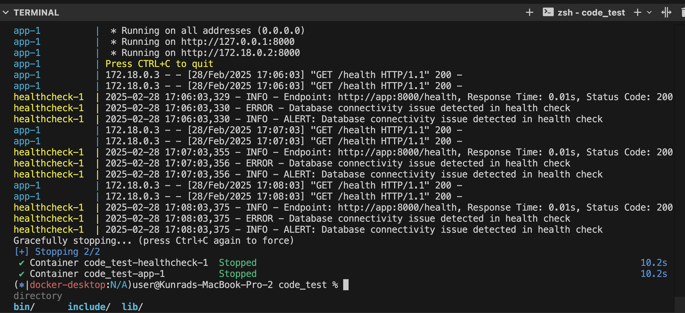

# Automated Health Check System

## Overview

This project implements an automated health check system for a simple webpage `health.py` built with `flask`. It periodically checks the health point of the web service `/health` and logs key metrics (`response time`, `HTTP Status`, and `health indicators`), and sends alerts when threshold are exceeded.

There are two files which currently does the same thing;

`async_health_check.py` (This uses async to check multiple endpoints)

`health_check.py` (This checks a single endpoint)

## Features

- **Health Check Script:**
  Sends HTTP GET requests to a configurable health endpoint (default: `http://localhost:8000/health`).
- **Metrics Collected:**

  - Response Time
  - HTTP Status Code
  - Optional health indicators from JSON responses (`db_status`).
- **Alerting Logic:**

  - Logs a warning if the response time exceeds a threshold (default: 3 seconds).
  - Logs an error if the HTTP status code is not 200.
  - Logs an error if any optional health indicators indicate a failure(`db_status` != `200`).
- **Retry Mechanism:**
  Retries transient failures up to a configurable number of times.
- **Configuration:**Uses environment variables to configure settings such as:

  - `HEALTH_ENDPOINT` (default: `http://localhost:8000/health`)
  - `CHECK_INTERVAL` in seconds (default: 300)
  - `RESPONSE_THRESHOLD` in seconds (default: 3.0)
  - `RETRY_COUNT` (default: 3)
  - `RETRY_DELAY` in seconds (default: 2.0)
- **Logging & Notification:**
  Uses Python's logging library to log each health check. When an error is detected, a mock alert function simulates sending a notification.

## Setup and Running

### Prerequisites

- Python 3.x
- Docker

### Install the requirements

```bash
pip install -r requirements.txt 
```

### Start the WebService on a separate terminal

```bash
python health.py
```

### Execute the Health Check Python Script

```bash
python health_check.py
```

```bash
python async_health_check.py
```

## Using Docker

I have created multiple docker files to serve the application and the health checker

`Dockerfile.app` This would build the web application

`Dockerfile` This would build the `health_check` application. Remember to change the value of  `CMD ["python", "health_check.py"]` to reference either the `multiple endpoints` or the `single endpoints`

### Docker Compose

a `docker-compose.yml` file has also been created to implement and test the applications on a local computer


